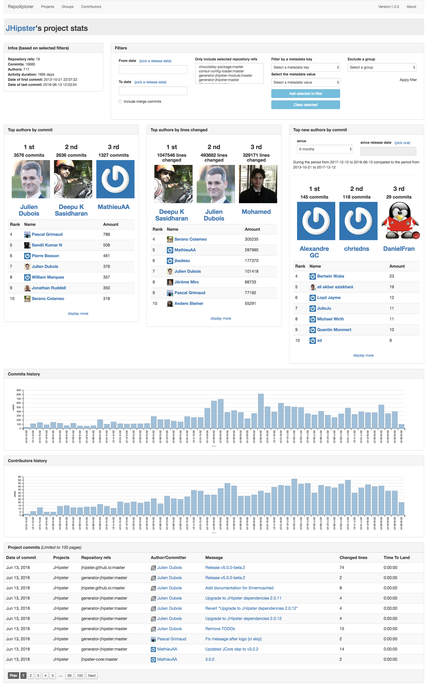
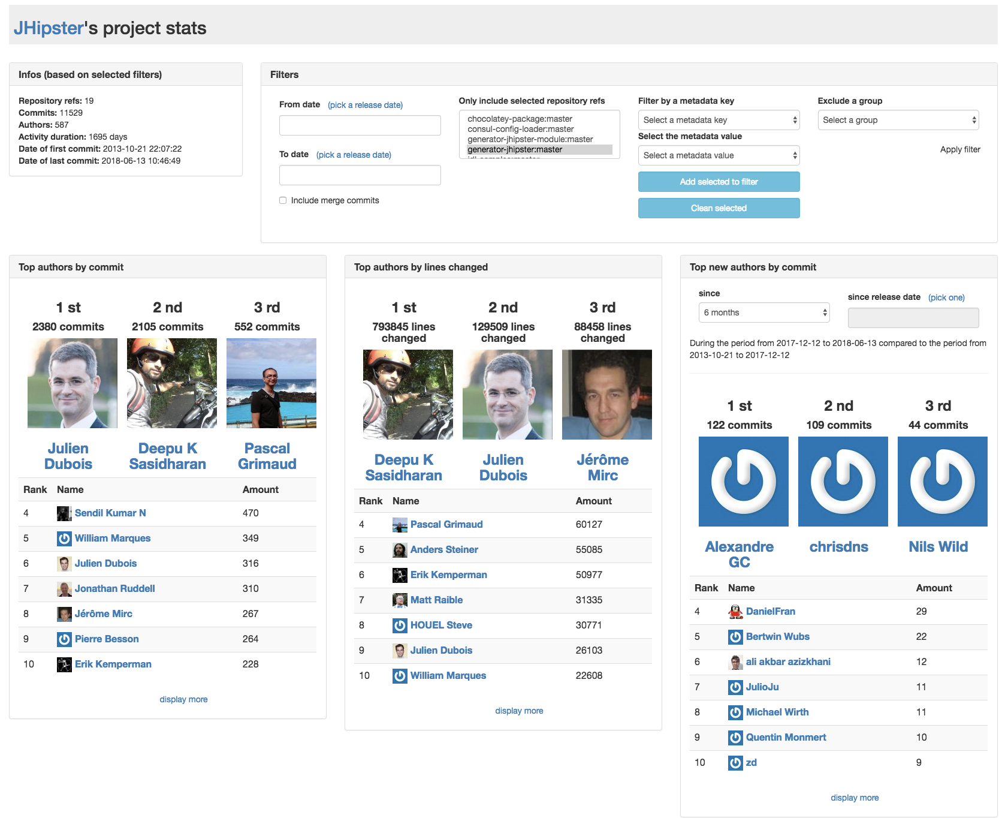
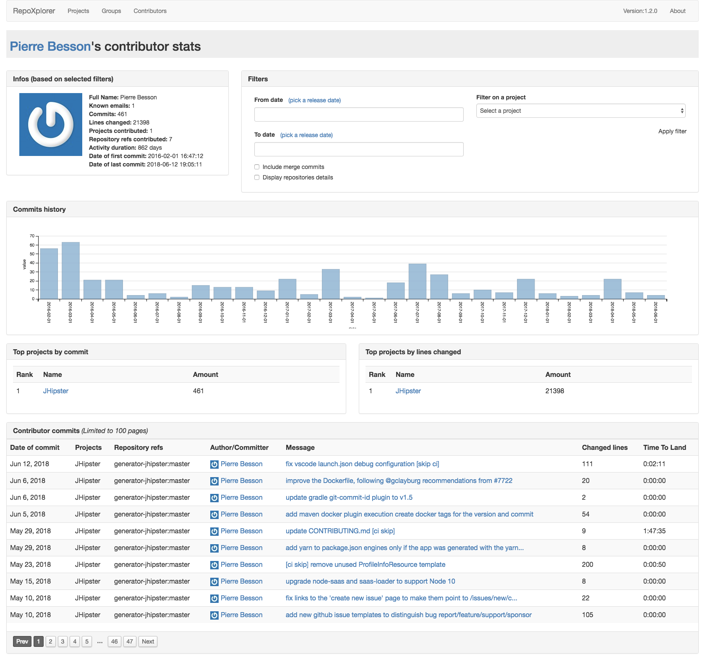

# JHipster Github organisation repositories explorer

Based on [morucci/repoxplorer](https://github.com/morucci/repoxplorer)

## How to use

Run with `docker-compose up -d` and open [localhost:51000/index.html](http://localhost:51000/index.html) and wait a bit for the data to be indexed.

Configuration reference for the `conf/projects.yaml file`: [morucci/repoxplorer#configuration](https://github.com/morucci/repoxplorer#configuration)

## Screenshots taken on June 18th 2018

### Global stats for the JHipster organisation

### Project specific stats for generator-jhipster

### Pierre Besson's contributions

